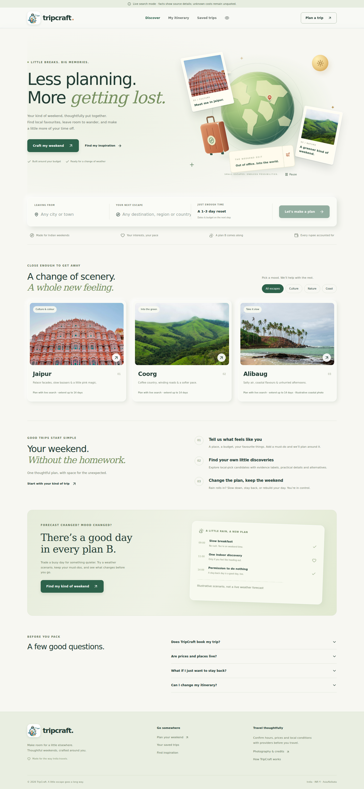
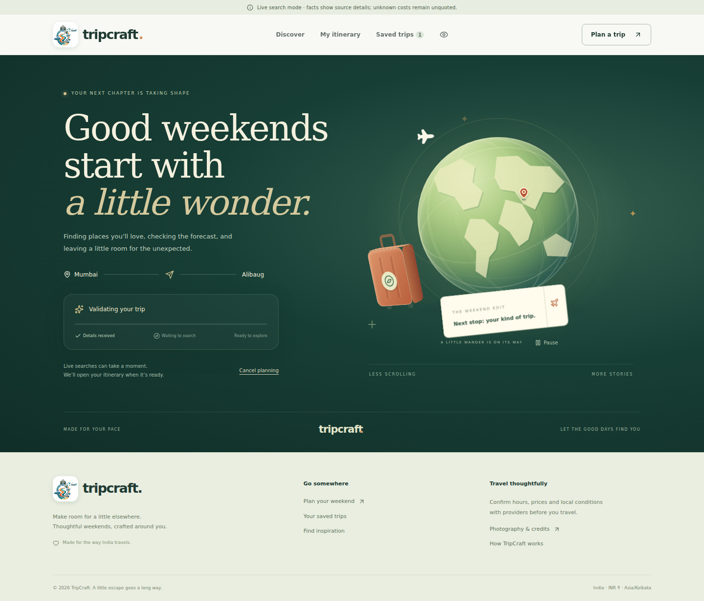
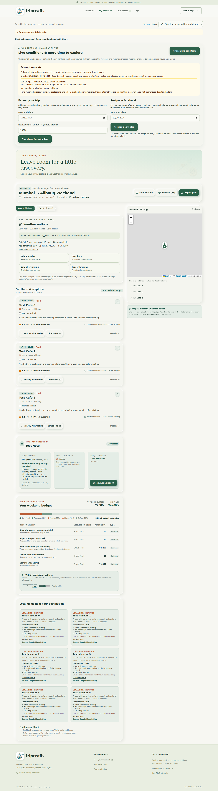

<div align="center">

# ✈️ TripCraft 2.0

### **Intelligent, Live-Sourced Travel Planning for India**

[](https://www.oracle.com/java/)
[](https://spring.io/projects/spring-boot)
[](https://react.dev/)
[](https://www.typescriptlang.org/)
[](https://vitejs.dev/)
[](https://tailwindcss.com/)
[](https://leafletjs.com/)

<p align="center">
  <b>A full-stack, enterprise-grade travel planner pairing a high-performance Java 17 + Spring Boot modular monolith backend with a dynamic React 19 + TypeScript frontend.</b>
</p>

[Key Features](#-key-features) •
[Screenshots](#-visual-showcase) •
[Architecture](#-system-architecture) •
[Quick Start](#-quick-start) •
[Environment Variables](#-configuration--environment-variables) •
[Available Scripts](#-project-scripts) •
[Verification](#-testing--verification)

---

</div>

## 🌟 Overview

**TripCraft 2.0** is an intelligent travel planning platform engineered specifically for destinations across India. Combining live data streams from **SerpApi** (Google Maps places, restaurants, hotels, flights, and disruption news), real-time forecasts from **Open-Meteo**, and optional AI candidate ranking via **Groq LLM**, TripCraft builds realistic, constraint-validated multi-day itineraries.

The system replaces synthetic mock itineraries with authentic live-sourced data:
- **Zero Hallucinated Locations:** Every recommendation is grounded in live provider queries.
- **Dynamic Weather Adaptation:** Automated 16-day forecast integration with smart indoor-first pivot heuristics during inclement conditions.
- **Enterprise-Grade Backend:** Re-architected in Java 17 & Spring Boot 3.5 with atomic JSON persistence, signed session tokens, and crash-resilient background job management.

---

## 📸 Visual Showcase

<div align="center">

| 🌍 3D Animated Hero Experience | 📋 Interactive Trip Wizard |
| :---: | :---: |
|  |  |
| *Interactive 3D CSS globe, orbiting plane & parallax effects* | *Step-by-step custom pace, dietary, stay & anchor preferences* |

| 🗺️ Itinerary Workspace & Maps | 📱 Responsive Mobile Experience |
| :---: | :---: |
|  |  |
| *Timeline management, Leaflet map routing & live budget breakdown* | *Fully adaptive layout with gesture & reduced-motion support* |

</div>

---

## ✨ Key Features

### 🗺️ Multi-Day Itinerary Engine
- **1 to 14 Day Planning:** Dynamically generates balanced daily itineraries customized by travel pace, rest gaps, and preferred food styles.
- **Fixed Anchor Activities:** Pin must-do attractions to specific days and let the constraint solver schedule around them.
- **Dietary & Accessibility Filters:** Explicit support for vegetarian/vegan diets and mobility-conscious itineraries.
- **Lock & Visited Markers:** Lock key stops against accidental rescheduling and mark completed activities as you travel.

### 🌦️ Live Weather & Smart Replanning
- **16-Day Forecast Horizon:** Integrates Open-Meteo for daily high/low temperatures, precipitation chances, rainfall volume, and wind speeds.
- **Smart Risk Heuristics:** Automated warnings for rain (≥60%), extreme heat (≥38°C), and severe weather / thunderstorms (code ≥95).
- **Single-Click Weather Adaptation:** Automatically pause unlocked outdoor activities and swap in curated indoor alternatives or low-effort schedules.
- **Live Disruption Watch:** Pulls recent verified news reports for travel disruptions, road closures, and regional advisories.

### 🔍 Grounded Live Provider Integrations
- **SerpApi Engine:** Queries Google Maps places, top-rated restaurants, hotel accommodations, and indicative flight connections.
- **Local-Pick Confidence:** Identifies verified local favorites with corroboration links and distance proximity within a 5 km radius.
- **Budget Tracking:** Integer-paise financial precision with food costs counted accurately and clear itemized expense breakdowns.

### 🤖 Grounded AI Ranking (Optional Groq)
- **Safe Hybrid Planning:** Groq models (`openai/gpt-oss-120b` or custom) rank pre-filtered candidate places without hallucinating details.
- **Strict Server-Side Validation:** The Spring Boot backend owns scheduling, time windows, and budget math. If AI credentials are unavailable or format errors occur, the planner seamlessly falls back to the deterministic constraint engine.

### 🎨 Immersive & Accessible Interface
- **3D Animated Elements:** Lightweight CSS 3D interactive globe, orbiting aircraft, floating postcards, and pointer parallax.
- **Full Motion Controls:** Dedicated pause toggles and automatic honoring of `prefers-reduced-motion` browser preferences.
- **Export & Print Ready:** Export clean JSON files or generate printable/PDF travel dossiers with one click.

### 🔒 Enterprise Persistence & Sessions
- **Signed Session Cookies:** Cryptographically signed HMAC guest sessions to protect trip ownership without mandatory sign-up walls.
- **Atomic Persistence:** Robust file-lock-protected atomic state storage preventing race conditions and data corruption.
- **Job Recovery:** Background generation tasks automatically recover from restarts with graceful cancellation and retry mechanisms.

---

## 🏗️ System Architecture

TripCraft is structured as a **modular monolith** with clean separation between the presentation layer, REST API, scheduling domain, and provider gateways.

```
┌─────────────────────────────────────────────────────────────────────────────┐
│                          React 19 + Vite Frontend                           │
│     (Tailwind CSS 4 • Leaflet Maps • Lucide Icons • 3D CSS Scenes)         │
└──────────────────────────────────────┬──────────────────────────────────────┘
                                       │  HTTP /api/v1  (Proxy in dev)
                                       ▼
┌─────────────────────────────────────────────────────────────────────────────┐
│                       Java 17 + Spring Boot 3 Backend                       │
│                                                                             │
│  ┌────────────────────────┐  ┌───────────────────────┐  ┌────────────────┐  │
│  │     TripController     │  │     SessionFilter     │  │   StateStore   │  │
│  │  REST Endpoints & Jobs │  │ Signed HMAC & Headers │  │  Atomic JSON   │  │
│  └───────────┬────────────┘  └───────────────────────┘  └───────▲────────┘  │
│              │                                                  │           │
│  ┌───────────▼────────────┐  ┌───────────────────────┐          │           │
│  │     PlannerService     │──│    ScheduleService    │──────────┤           │
│  │ Multi-day Engine & Alt │  │  Pace, Gaps & Anchors │          │           │
│  └───────────┬────────────┘  └───────────────────────┘          │           │
│              │                                                  │           │
│  ┌───────────▼────────────┐  ┌───────────────────────┐  ┌───────▼────────┐  │
│  │    DiscoveryService    │  │    WeatherService     │  │ BudgetService  │  │
│  │ SerpApi & Groq Ground  │  │   Open-Meteo Radar    │  │ Integer-Paise  │  │
│  └───────────┬────────────┘  └───────────┬───────────┘  └────────────────┘  │
└──────────────┼───────────────────────────┼──────────────────────────────────┘
               │                           │
               ▼                           ▼
      ┌─────────────────┐         ┌─────────────────┐
      │     SerpApi     │         │   Open-Meteo    │
      │  (Google Maps/  │         │   (16-Day Live  │
      │   Hotels/News)  │         │    Forecasts)   │
      └─────────────────┘         └─────────────────┘
```

---

## 🧰 Tech Stack

| Domain | Technology | Details |
| :--- | :--- | :--- |
| **Backend** | Java 17, Spring Boot 3.5.16 | Embedded Tomcat, Jakarta Validation, HttpClient |
| **Frontend** | React 19, TypeScript, Vite 8 | Modern React hooks, typed domain contracts |
| **Styling** | Tailwind CSS 4, Modern CSS3 | Custom 3D CSS perspective transforms, dark/light accents |
| **Mapping** | Leaflet 1.9, React-Leaflet | OpenStreetMap tiles, interactive coordinate pins |
| **Live Travel Data** | SerpApi | Google Maps places, reviews, hotels, flights & news |
| **Weather** | Open-Meteo API | Free global non-commercial forecast API (up to 16 days) |
| **Optional AI** | Groq Cloud API | High-throughput candidate place ranking |
| **Testing** | JUnit 5, Mockito, Playwright | Unit, integration, and full-stack end-to-end testing |

---

## 🚀 Quick Start

### Prerequisites
- **JDK 17 or newer** (`java -version` and `javac -version`)
- **Node.js 22.12+** and **npm** (`node -version`)
- **SerpApi API Key** (Free tier available at [serpapi.com](https://serpapi.com/manage-api-key))

---

### Option A: Run Pre-Packaged JAR (Instant Launch)

The repository includes a ready-to-run compiled JAR that bundles both the backend API and frontend assets:

```powershell
# 1. Clone repository & enter folder
cd tripcraft

# 2. Configure environment
if (!(Test-Path .env)) { Copy-Item .env.example .env }

# 3. Add your SerpApi key to .env, then run:
java -jar backend/tripcraft-backend.jar
```

Open **http://localhost:8080** in your browser.

---

### Option B: Full Development Setup (Hot Reload)

For active frontend and backend development:

```powershell
# 1. Install frontend dependencies
npm ci

# 2. Build the Spring Boot backend
npm run build:backend

# 3. Launch dual development server
npm run dev
```

- **Frontend (Vite with Hot Module Replacement):** [http://localhost:3000](http://localhost:3000)
- **Backend (Spring Boot API):** [http://localhost:8080](http://localhost:8080)
- Requests to `/api/*` on port `3000` are automatically proxied to port `8080`.

---

## ⚙️ Configuration & Environment Variables

Copy `.env.example` to `.env` in the project root:

```env
# ==============================================================================
# Live Travel Provider (Required for Real Places & Corroboration)
# ==============================================================================
SERPAPI_API_KEY=your_serpapi_account_key

# ==============================================================================
# AI Place Ranking (Optional)
# ==============================================================================
GROQ_API_KEY=your_groq_api_key
GROQ_MODEL=openai/gpt-oss-120b

# ==============================================================================
# Live Weather Provider (Open-Meteo)
# ==============================================================================
WEATHER_BASE_URL=https://api.open-meteo.com/v1/forecast
WEATHER_API_KEY=

# ==============================================================================
# Server & Security Settings
# ==============================================================================
PORT=8080
HOST=127.0.0.1
DATA_DIR=.data
SESSION_SECRET=your_random_session_secret_here
COOKIE_SECURE=false
FRONTEND_ORIGIN=http://localhost:3000
```

### Key Provider Notes:
- **SerpApi:** A single API key powers Google Maps places, restaurants, corroboration, hotels, flights, and news. No separate Google Cloud console key required.
- **Groq:** If omitted, TripCraft automatically uses its robust built-in constraint ranking engine.
- **Open-Meteo:** The default public endpoint requires no API key. For high-volume or commercial usage, supply a paid customer endpoint and key.

---

## 📜 Project Scripts

Run the following commands from the project root:

| Command | Action |
| :--- | :--- |
| `npm run dev` | Starts Spring Boot on `8080` & Vite with HMR on `3000` simultaneously |
| `npm run dev:frontend` | Starts only the Vite development server on port `3000` |
| `npm run build` | Compiles and builds the production React application to `dist/` |
| `npm run build:backend` | Packages the Spring Boot backend JAR using Maven Wrapper |
| `npm start` | Launches the packaged production JAR (`tripcraft-backend.jar`) |
| `npm run lint` | Runs TypeScript compiler checks across the codebase (`tsc --noEmit`) |
| `npm run test:backend` | Runs Java unit and integration tests via Maven |
| `npm run test:e2e` | Runs Playwright end-to-end browser tests against live JAR |
| `npm run format` | Formats source files using Prettier |

---

## 📁 Repository Structure

```
tripcraft/
├── backend/                       # Java 17 + Spring Boot 3.5 application
│   ├── src/main/java/in/tripcraft # Domain controllers, services, security
│   ├── src/test/java/in/tripcraft # Unit and integration tests
│   ├── pom.xml                    # Maven configuration & dependencies
│   ├── mvnw / mvnw.cmd            # Maven wrapper binaries
│   └── tripcraft-backend.jar      # Pre-packaged executable JAR
├── docs/                          # Architecture & design documentation
│   ├── screenshots/               # Application preview images
│   ├── ARCHITECTURE.md            # Service boundaries & data flows
│   ├── REQUIREMENTS.md            # Product specification traceability
│   └── VERIFICATION.md            # Test matrix and verification records
├── public/                        # Static assets (images, icons, credits)
├── scripts/                       # Node automation and build helper scripts
│   ├── dev.mjs                    # Dual-process development runner
│   ├── build-backend.mjs          # Cross-platform Maven invoker
│   └── browser-check.mjs          # Playwright test harness
├── src/                           # React 19 Frontend application
│   ├── components/                # UI components (Wizard, Hero, Workspace, Map)
│   ├── types/                     # TypeScript shared interfaces
│   ├── App.tsx                    # Root application component & routing
│   └── index.css                  # Tailwind styles and 3D animations
├── .env.example                   # Sample environment configuration
├── package.json                   # Frontend dependencies & npm scripts
├── tsconfig.json                  # TypeScript compiler settings
└── vite.config.ts                 # Vite bundler configuration & proxy
```

---

## 🧪 Testing & Verification

TripCraft features multi-layer verification to guarantee high reliability:

```powershell
# 1. Typecheck frontend
npm run lint

# 2. Run backend test suite
npm run test:backend

# 3. Build frontend bundle
npm run build

# 4. Install browser binaries & execute E2E tests
npx playwright install chromium
npm run test:e2e
```

The Playwright browser tests launch the real Spring Boot JAR with isolated local HTTP provider fixtures to validate end-to-end trip creation, weather adaptation, and session restoration.

---

## 🛠️ Troubleshooting & Windows Notes

<details>
<summary><b>Click to expand Windows / Java environment troubleshooting</b></summary>

### 1. "No compiler is provided in this environment"
If Maven reports this error, your `java` command is pointing to a JRE rather than a full JDK.
- Install **JDK 17** or newer (e.g., from [Adoptium Eclipse Temurin](https://adoptium.net/)).
- Set your `JAVA_HOME` environment variable to the root JDK folder (not the `bin` directory):
  ```powershell
  $env:JAVA_HOME = "C:\Program Files\Eclipse Adoptium\jdk-17.0.x"
  npm run build:backend
  ```

### 2. PowerShell Script Execution Disabled
If PowerShell blocks npm scripts, run:
```powershell
Set-ExecutionPolicy -Scope Process -ExecutionPolicy Bypass
```
Or execute directly using `npm.cmd`:
```powershell
npm.cmd run dev
```

### 3. Session / Saved Trips Persistence
Trips are saved in the `.data/` directory. If you clear browser cookies or change between `localhost` and `127.0.0.1`, session ownership tokens will not match. Use the exact same hostname when accessing saved itineraries.

</details>

---

## 📄 License & Attribution

- **License:** Distributed under the [MIT License](LICENSE).
- **Photography:** Sourced imagery credits are cataloged in [`public/images/credits.json`](public/images/credits.json).
- **Weather Data:** Powered by [Open-Meteo](https://open-meteo.com) under Non-Commercial terms.

---

<div align="center">
  <sub>Built with ❤️ for travelers exploring the incredible diversity of India.</sub>
</div>
