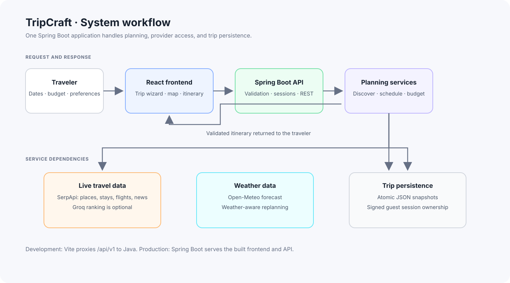

# TripCraft

TripCraft is a full-stack trip planner for India. It combines a React and TypeScript interface with a Java and Spring Boot API to create, adapt, and save multi-day itineraries.

## System workflow

The diagram shows the main request and data flow. The SVG can be imported into Excalidraw if you want to annotate or adapt it.



Diagram file: [`docs/system-workflow.svg`](docs/system-workflow.svg)

### What happens when a trip is planned

1. The traveler enters dates, destination, budget, pace, and preferences in the React app.
2. The frontend sends an `/api/v1` request to the Spring Boot backend. During local development, Vite proxies this request to Java.
3. The backend validates the request and obtains a signed guest session when needed.
4. Planner and discovery services gather candidate places and supporting information. SerpApi provides live travel results; Open-Meteo provides weather. Groq ranking is optional.
5. The scheduling and budget services build a constraint-aware itinerary. The backend validates and stores trip state as atomic JSON snapshots.
6. The API returns the itinerary to the frontend, where the traveler can review, adapt, save, and export it.

TripCraft is a **modular monolith**. These backend services run in one Spring Boot application; they are not separately deployed microservices.

## Features

- Build itineraries for trips from 1 to 14 days.
- Set travel pace, budget, food preferences, accessibility needs, and fixed activities.
- Review places sourced from live provider results.
- Choose flight search or bus- or train-preferred transit route suggestions where provider coverage is available.
- Open train searches on IRCTC and bus route listings on redBus; TripCraft does not sell tickets or claim seat availability.
- Check forecasts and adapt plans around weather risks.
- Track trip budgets and edit, lock, or mark itinerary stops as visited.
- Save trips with signed guest sessions, then export or print an itinerary.
- Use optional Groq ranking; deterministic ranking remains available without Groq credentials.

## Technology

| Area | Technology |
| --- | --- |
| Frontend | React 19, TypeScript, Vite 8, Tailwind CSS 4 |
| Maps | Leaflet and OpenStreetMap tiles |
| Backend | Java 17, Spring Boot 3.5, embedded Tomcat |
| Trip data | SerpApi for travel search; Open-Meteo for weather |
| Transit routes | SerpApi Google Maps Directions, with bus or train preference |
| Optional ranking | Groq API |
| Persistence | Atomic JSON snapshots in the configured data directory |

## Run locally

### Requirements

- Java 17 or newer (a JDK is needed to build the backend)
- Node.js 22.12 or newer and npm

### Development mode

From the repository root:

```powershell
npm ci
npm run build:backend
npm run dev
```

Open `http://localhost:3000`. Vite serves the frontend and proxies `/api` requests to the Java backend on port `8080`.

### Production-style local run

Build the frontend and backend, then start the packaged Java application:

```powershell
npm ci
npm run build
npm run build:backend
npm start
```

Open `http://localhost:8080`. The Spring Boot application serves the built frontend and API from the same process.

## Configuration

Set environment variables in your deployment platform or in a local `.env` file. Never commit real API keys or session secrets.

| Variable | Required | Purpose |
| --- | --- | --- |
| `PORT` | No | HTTP port; defaults to `8080` and uses the platform-provided value when set. |
| `SERPAPI_API_KEY` | No | Enables live travel search results. |
| `GROQ_API_KEY` | No | Enables optional AI ranking of discovered candidates. |
| `GROQ_MODEL` | No | Groq model name; defaults to `openai/gpt-oss-120b`. |
| `WEATHER_API_KEY` | No | Optional key for a weather provider endpoint that requires one. |
| `WEATHER_BASE_URL` | No | Weather endpoint; defaults to Open-Meteo. |
| `DATA_DIR` | No | Directory for persisted trip state; defaults to `.data`. |
| `SESSION_SECRET` | Recommended in production | Stable secret for signing guest session cookies. |
| `COOKIE_SECURE` | Recommended in production | Set `true` when serving over HTTPS. |
| `FRONTEND_ORIGIN` | No | Allowed frontend origin; defaults to `http://localhost:3000`. |

See [`.env.example`](.env.example) for a local configuration template. Open-Meteo's default endpoint does not require a key.

## Deployment notes

- The backend Dockerfile is [`backend/Dockerfile`](backend/Dockerfile). Build with `backend` as the Docker build context, or configure the deployment root directory to `backend`.
- The service listens on `0.0.0.0` and uses `PORT`, including the port assigned by Render.
- The Vercel rewrite in [`vercel.json`](vercel.json) needs its destination changed from the placeholder to the deployed backend URL.
- Configure a persistent disk for `DATA_DIR` if trip data must survive backend restarts. Use a stable `SESSION_SECRET` across restarts.

## Useful commands

| Command | Purpose |
| --- | --- |
| `npm run dev` | Run Vite and the Java backend for development. |
| `npm run dev:frontend` | Run only the Vite frontend. |
| `npm run build` | Build the frontend into `dist/`. |
| `npm run build:backend` | Package the Spring Boot backend. |
| `npm start` | Start the packaged backend. |
| `npm run lint` | Run the TypeScript compiler checks. |
| `npm run test:backend` | Run the Java backend test suite. |
| `npm run test:e2e` | Run the Playwright browser flow. |

## Repository layout

```text
backend/   Spring Boot application, API, services, and tests
docs/      Architecture notes, verification records, and workflow diagram
public/    Static images and frontend assets
scripts/   Build, development, and browser-check helpers
src/       React application and UI components
```

## License and credits

TripCraft is distributed under the [MIT License](LICENSE). Image credits are listed in [`public/images/credits.json`](public/images/credits.json). Weather data is provided by [Open-Meteo](https://open-meteo.com/).
